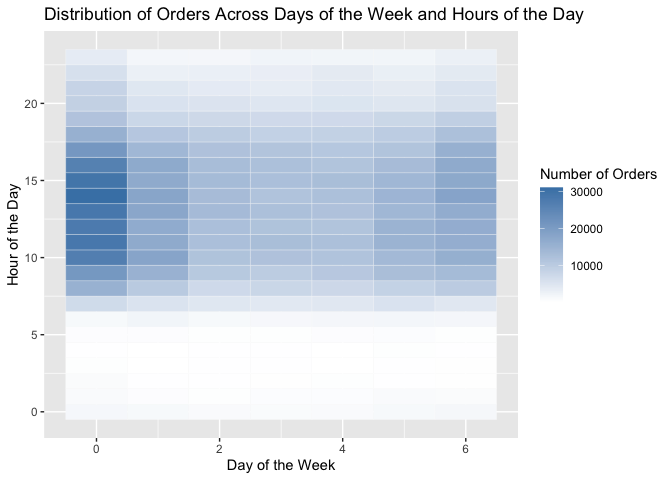

HW 3 Data Science
================
Victoria Mello (vsm2118)
October 14, 2023

# Promblem 1

``` r
library(tidyverse)
```

    ## ── Attaching core tidyverse packages ──────────────────────── tidyverse 2.0.0 ──
    ## ✔ dplyr     1.1.3     ✔ readr     2.1.4
    ## ✔ forcats   1.0.0     ✔ stringr   1.5.0
    ## ✔ ggplot2   3.4.3     ✔ tibble    3.2.1
    ## ✔ lubridate 1.9.2     ✔ tidyr     1.3.0
    ## ✔ purrr     1.0.2     
    ## ── Conflicts ────────────────────────────────────────── tidyverse_conflicts() ──
    ## ✖ dplyr::filter() masks stats::filter()
    ## ✖ dplyr::lag()    masks stats::lag()
    ## ℹ Use the conflicted package (<http://conflicted.r-lib.org/>) to force all conflicts to become errors

``` r
library(p8105.datasets)
data("instacart")
```

Exploratory Analysis:

The distribution of orders across the days of the week and the hours of
the day…

``` r
instacart %>%  
  group_by(order_dow, order_hour_of_day) %>% 
  summarize(n_orders = n()) %>% 
  ggplot(aes(x = order_dow, y = order_hour_of_day, fill = n_orders)) +
  geom_tile(color = "white") +
  scale_fill_gradient(low = "white", high = "steelblue") +
  labs(x = "Day of the Week", y = "Hour of the Day", fill = "Number of Orders",
       title = "Distribution of Orders Across Days of the Week and Hours of the Day")
```

    ## `summarise()` has grouped output by 'order_dow'. You can override using the
    ## `.groups` argument.

<!-- -->

Top 10 most ordered products…

``` r
instacart %>%
  group_by(product_name) %>%
  summarize(n_orders = n()) %>%
  arrange(desc(n_orders)) %>%
  head(10) %>%
  ggplot(aes(x = reorder(product_name, n_orders), y = n_orders)) +
  geom_bar(stat = "identity", fill = "steelblue") +
  coord_flip() +
  labs(x = "Product", y = "Number of Orders", title = "Top 10 Most Ordered Products")
```

<!-- -->

The Instacart dataset has 1384617 observations and 15 variables. It
provides detailed information about the orders placed by Instacart
users, including the order sequence, the day and hour of the order, and
the time since the previous order. The dataset also includes information
about the products ordered, such as the product name and the aisle and
department where the product is located.
