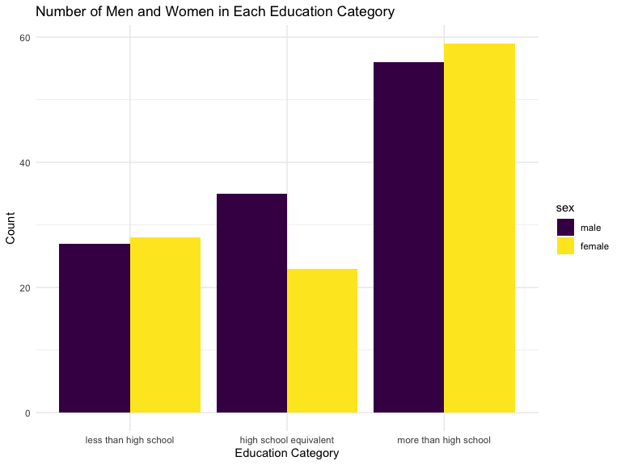
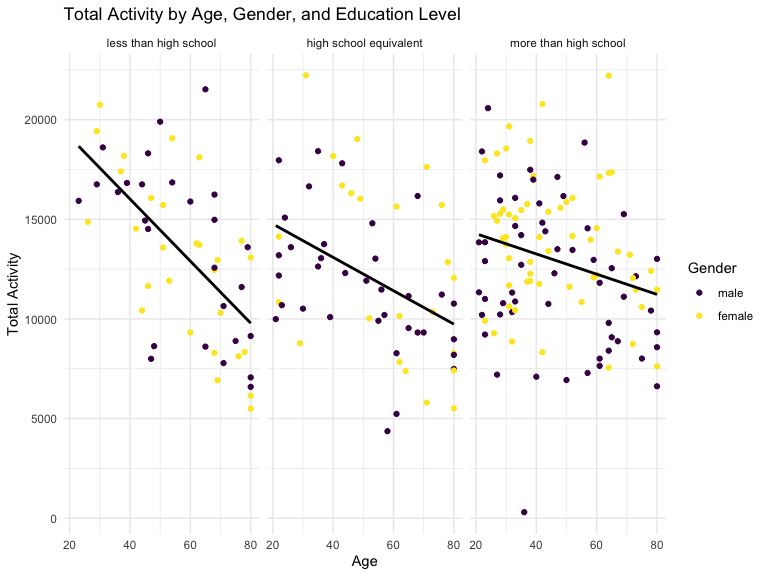
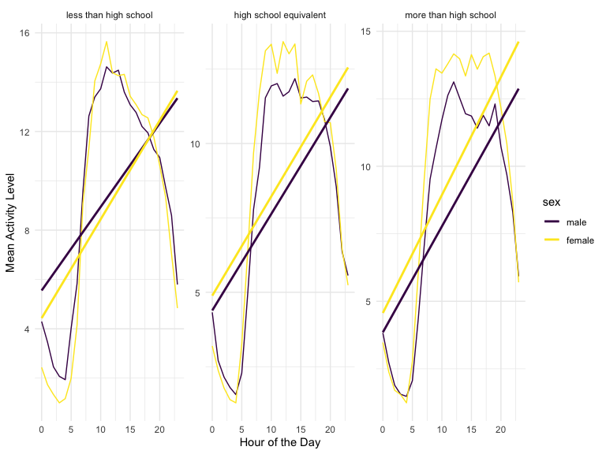

HW 3 Data Science
================
Victoria Mello (vsm2118)
October 14, 2023

## Problem 1

#### Read in the data

``` r
data("instacart")

instacart = 
  instacart |> 
  as_tibble()
```

#### Answer questions about the data

This dataset contains 1384617 rows and 15 columns, with each row
resprenting a single product from an instacart order. Variables include
identifiers for user, order, and product; the order in which each
product was added to the cart. There are several order-level variables,
describing the day and time of the order, and number of days since prior
order. Then there are several item-specific variables, describing the
product name (e.g. Yogurt, Avocado), department (e.g. dairy and eggs,
produce), and aisle (e.g. yogurt, fresh fruits), and whether the item
has been ordered by this user in the past. In total, there are 39123
products found in 131209 orders from 131209 distinct users.

Below is a table summarizing the number of items ordered from aisle. In
total, there are 134 aisles, with fresh vegetables and fresh fruits
holding the most items ordered by far.

``` r
instacart |> 
  count(aisle) |> 
  arrange(desc(n))
```

    ## # A tibble: 134 × 2
    ##    aisle                              n
    ##    <chr>                          <int>
    ##  1 fresh vegetables              150609
    ##  2 fresh fruits                  150473
    ##  3 packaged vegetables fruits     78493
    ##  4 yogurt                         55240
    ##  5 packaged cheese                41699
    ##  6 water seltzer sparkling water  36617
    ##  7 milk                           32644
    ##  8 chips pretzels                 31269
    ##  9 soy lactosefree                26240
    ## 10 bread                          23635
    ## # ℹ 124 more rows

Next is a plot that shows the number of items ordered in each aisle.
Here, aisles are ordered by ascending number of items.

``` r
instacart |> 
  count(aisle) |> 
  filter(n > 10000) |> 
  mutate(aisle = fct_reorder(aisle, n)) |> 
  ggplot(aes(x = aisle, y = n)) + 
  geom_point() + 
  labs(title = "Number of items ordered in each aisle") +
  theme(axis.text.x = element_text(angle = 60, hjust = 1))
```


Our next table shows the three most popular items in aisles
`baking ingredients`, `dog food care`, and `packaged vegetables fruits`,
and includes the number of times each item is ordered in your table.

``` r
instacart |> 
  filter(aisle %in% c("baking ingredients", "dog food care", "packaged vegetables fruits")) |>
  group_by(aisle) |> 
  count(product_name) |> 
  mutate(rank = min_rank(desc(n))) |> 
  filter(rank < 4) |> 
  arrange(desc(n)) |>
  knitr::kable()
```

| aisle                      | product_name                                  |    n | rank |
|:---------------------------|:----------------------------------------------|-----:|-----:|
| packaged vegetables fruits | Organic Baby Spinach                          | 9784 |    1 |
| packaged vegetables fruits | Organic Raspberries                           | 5546 |    2 |
| packaged vegetables fruits | Organic Blueberries                           | 4966 |    3 |
| baking ingredients         | Light Brown Sugar                             |  499 |    1 |
| baking ingredients         | Pure Baking Soda                              |  387 |    2 |
| baking ingredients         | Cane Sugar                                    |  336 |    3 |
| dog food care              | Snack Sticks Chicken & Rice Recipe Dog Treats |   30 |    1 |
| dog food care              | Organix Chicken & Brown Rice Recipe           |   28 |    2 |
| dog food care              | Small Dog Biscuits                            |   26 |    3 |

Finally is a table showing the mean hour of the day at which Pink Lady
Apples and Coffee Ice Cream are ordered on each day of the week. This
table has been formatted in an untidy manner for human readers. Pink
Lady Apples are generally purchased slightly earlier in the day than
Coffee Ice Cream, with the exception of day 5.

``` r
instacart |>
  filter(product_name %in% c("Pink Lady Apples", "Coffee Ice Cream")) |>
  group_by(product_name, order_dow) |>
  summarize(mean_hour = mean(order_hour_of_day)) |>
  pivot_wider(
    names_from = order_dow, 
    values_from = mean_hour) |>
  knitr::kable(digits = 2)
```

    ## `summarise()` has grouped output by 'product_name'. You can override using the
    ## `.groups` argument.

| product_name     |     0 |     1 |     2 |     3 |     4 |     5 |     6 |
|:-----------------|------:|------:|------:|------:|------:|------:|------:|
| Coffee Ice Cream | 13.77 | 14.32 | 15.38 | 15.32 | 15.22 | 12.26 | 13.83 |
| Pink Lady Apples | 13.44 | 11.36 | 11.70 | 14.25 | 11.55 | 12.78 | 11.94 |

## Problem 2

Data Cleaning

``` r
data("brfss_smart2010")

# Data cleaning
brfss_data_cleaned <- brfss_smart2010 %>%
    janitor::clean_names() %>% 
    filter(topic == "Overall Health") %>%
    filter(response %in% c("Excellent", "Very Good", "Good", "Fair", "Poor")) %>%
    rename(state = locationabbr) %>% 
    mutate(response = factor(response, levels = c("Poor", "Fair", "Good", "Very Good", "Excellent"), ordered = TRUE))

variable.names(brfss_data_cleaned)
```

    ##  [1] "year"                       "state"                     
    ##  [3] "locationdesc"               "class"                     
    ##  [5] "topic"                      "question"                  
    ##  [7] "response"                   "sample_size"               
    ##  [9] "data_value"                 "confidence_limit_low"      
    ## [11] "confidence_limit_high"      "display_order"             
    ## [13] "data_value_unit"            "data_value_type"           
    ## [15] "data_value_footnote_symbol" "data_value_footnote"       
    ## [17] "data_source"                "class_id"                  
    ## [19] "topic_id"                   "location_id"               
    ## [21] "question_id"                "respid"                    
    ## [23] "geo_location"

In 2002 and 2010, which states were observed at 7 or more locations?

``` r
# States observed at 7 or more locations in 2002
states_2002 <- brfss_data_cleaned %>%
  filter(year == 2002) %>%
  group_by(state) %>%
  summarize(count = n()) %>%
  filter(count >= 7) %>%
  arrange(desc(count))

# States observed at 7 or more locations in 2010
states_2010 <- brfss_data_cleaned %>%
  filter(year == 2010) %>%
  group_by(state) %>%
  summarize(count = n()) %>%
  filter(count >= 7) %>%
  arrange(desc(count))

knitr::kable(states_2002, caption =  "States with 7 or more observations in 2002", format = "markdown")
```

| state | count |
|:------|------:|
| PA    |    40 |
| MA    |    32 |
| NJ    |    32 |
| CT    |    28 |
| FL    |    28 |
| NC    |    28 |
| MD    |    24 |
| NH    |    20 |
| NY    |    20 |
| UT    |    20 |
| CO    |    16 |
| HI    |    16 |
| MI    |    16 |
| MN    |    16 |
| OH    |    16 |
| RI    |    16 |
| WA    |    16 |
| DE    |    12 |
| GA    |    12 |
| IL    |    12 |
| KS    |    12 |
| LA    |    12 |
| NE    |    12 |
| OK    |    12 |
| OR    |    12 |
| SC    |    12 |
| VT    |    12 |
| AZ    |     8 |
| ID    |     8 |
| IN    |     8 |
| ME    |     8 |
| MO    |     8 |
| NV    |     8 |
| SD    |     8 |
| TN    |     8 |
| TX    |     8 |

States with 7 or more observations in 2002

``` r
knitr::kable(states_2010, caption =  "States with 7 or more observations in 2010", format = "markdown")
```

| state | count |
|:------|------:|
| FL    |   164 |
| NJ    |    76 |
| TX    |    64 |
| CA    |    48 |
| MD    |    48 |
| NC    |    48 |
| NE    |    40 |
| WA    |    40 |
| MA    |    36 |
| NY    |    36 |
| OH    |    32 |
| CO    |    28 |
| PA    |    28 |
| SC    |    28 |
| ID    |    24 |
| ME    |    24 |
| NM    |    24 |
| UT    |    24 |
| VT    |    24 |
| CT    |    20 |
| LA    |    20 |
| MN    |    20 |
| NH    |    20 |
| RI    |    20 |
| TN    |    20 |
| GA    |    16 |
| HI    |    16 |
| KS    |    16 |
| MI    |    16 |
| OR    |    16 |
| AL    |    12 |
| AR    |    12 |
| AZ    |    12 |
| DE    |    12 |
| IN    |    12 |
| MO    |    12 |
| MT    |    12 |
| ND    |    12 |
| OK    |    12 |
| IA    |     8 |
| IL    |     8 |
| MS    |     8 |
| NV    |     8 |
| SD    |     8 |
| WY    |     8 |

States with 7 or more observations in 2010

In 2002 a total of 36 states were observed at 7 or more locations. The
states observed at the most locations in 2002 were PA with 40, followed
by MA and NJ both having 32. By 2010, the total number of states
observed at 7 or more locations increased to 45. The states observed at
the most locations in 2010 were FL with 164, followed by NJ with 76, and
TX with 64 locations.

Dataset limited to Excellent responses and a spaghetti plot:

``` r
excellent_avg <- brfss_data_cleaned %>%
  filter(response == "Excellent") %>%
  group_by(state, year) %>%
  summarize(avg_data_value = mean(data_value)) %>%
  ggplot(aes(x = year, y = avg_data_value, group = state, color = state)) +
  geom_line() +
  labs(
    title = "Average Data Value Over Time (Excellent Responses) by State",
    x = "Year",
    y = "Average Data Value"
  ) +
  theme_minimal()
```

    ## `summarise()` has grouped output by 'state'. You can override using the
    ## `.groups` argument.

The plot provides a useful tool for visualizing and comparing trends in
the average data value of “Excellent” responses between states over
time. It allows for a comparison between states over the years 2002 to
2010. However, due to there being 50 states, the plot is quite busy and
it is challenging to distinguish between the lines of individual states.
One observation that can be made from the plot is that most states
appear to be following a similar fluctuating trend for the average
“Excellent” responses to the “Overall Health” topic over time. However,
without specific data points or a clearer view, it’s difficult to make
more detailed observations or conclusions.

Two-panel scatterplot showing the distribution of data_value for
responses (“Poor” to “Excellent”) among locations in NY State in the
years 2006 and 2010:

``` r
# Filter the dataset to include only NY State and the years 2006 and 2010
ny_data <- brfss_data_cleaned %>%
  filter(state == "NY" & year %in% c(2006, 2010) & response %in% c("Poor", "Fair", "Good", "Very Good", "Excellent"))

# Create the first plot: scatter plot of data_value vs. response for 2006
ny_data_2006 <- ny_data %>%
  filter(year == 2006)

plot_2006 <- ggplot(ny_data_2006, aes(x = response, y = data_value, color = locationdesc, size = data_value)) +
  geom_point(alpha = 0.5) +
  scale_color_discrete(name = "Location") +
  scale_size_continuous(range = c(1, 10)) +
  labs(title = "Distribution of Data Value by Location in New York State (2006)",
       x = "Response",
       y = "Data Value",
       color = "Location",
       size = "Data Value") +
  theme_minimal()

# Create the second plot: scatter plot of data_value vs. response for 2010
ny_data_2010 <- ny_data %>%
  filter(year == 2010)

plot_2010 <- ggplot(ny_data_2010, aes(x = response, y = data_value, color = locationdesc, size = data_value)) +
  geom_point(alpha = 0.5) +
  scale_color_discrete(name = "Location") +
  scale_size_continuous(range = c(1, 10)) +
  labs(title = "Distribution of Data Value by Location in New York State (2010)",
       x = "Response",
       y = "Data Value",
       color = "Location",
       size = "Data Value") +
  theme_minimal() 

# Combine the two plots into a single multipanel plot
plot_combined <- plot_2006 + plot_2010

ggsave("combined_plot.png", plot_combined, width = 12, height = 6, units = "in")

```

 As seen in the two panel
scatterplot showing the distribution of data_value for responses (“Poor”
to “Excellent”) among counties in NY State for the years 2006 and 2010,
the “Good” response option to the question “How is your general health?”
was the most common response, followed by “Excellent”, “Fair”, and
“Poor” in both years. Data from 2010 has information on a greater number
of NY counties than the 2006 dataset does, including information for
these additional counties: Bronx, Erie, and Monroe counties. \####
Finish comment with which NY counties had highest vs lowest general
health in each year

## Problem 3

``` r
# Load demographic data
demographics <- read.csv("nhanes_covar.csv", skip = 4)
view(demographics)

# Load accelerometer data
accelerometer <- read.csv("nhanes_accel.csv")
view(accelerometer)

# Tidy demographic data
demographics <- demographics %>%
  janitor::clean_names() %>%
  drop_na() %>%
  filter(age >= 21) %>%
  mutate(education = case_when(
    education == 1 ~ "Less than high school",
    education == 2 ~ "High school equivalent",
    education == 3 ~ "More than high school"
  ),
  sex = case_when(
    sex == 1 ~ "Male",
    sex == 2 ~ "Female"
  ))
view(demographics)

# Tidy accelerometer data -- FIX THIS !!!
reshaped_accelerometer <- accelerometer %>%
  janitor::clean_names() %>% 
  pivot_longer(
    cols = starts_with("min"),
    names_to = "minute",
    values_to = "activity_level"
  ) %>%
  mutate(minute = as.integer(gsub("min", "", minute)))


# Merge the reshaped accelerometer data with the demographics dataset using SEQN
merged_data <- demographics %>%
  inner_join(reshaped_accelerometer, by = "seqn")

view(merged_data)
```

Table for the number of men and women in each education category, and a
visualization of age distributions for men and women across education
categories:

``` r
# Create sex v education table
education_summary <- merged_data %>%
  group_by(education, sex) %>%
  summarize(
    count = n()
  ) %>%
  ungroup() 
```

    ## `summarise()` has grouped output by 'education'. You can override using the
    ## `.groups` argument.

``` r
# Bar chart depicting table 
education_summary %>%
  ggplot(aes(x = education, y = count, fill = sex)) +
  geom_bar(stat = "identity", position = "dodge") +
  labs(title = "Number of Men and Women in Each Education Category", x = "Education Category", y = "Count") +
  theme_minimal()
```



``` r
# Create a histogram for age distributions by gender and education category
age_distribution_plot <- merged_data %>%
  ggplot(aes(x = age, fill = sex)) +
  geom_histogram(binwidth = 5, position = "dodge") +
  facet_grid(sex ~ education) +
  labs(title = "Age Distributions by Gender and Education Category", x = "Age", y = "Count") +
  theme_minimal()

# View the table and plots
education_summary
```

    ## # A tibble: 6 × 3
    ##   education              sex    count
    ##   <chr>                  <chr>  <int>
    ## 1 High school equivalent Female 33120
    ## 2 High school equivalent Male   50400
    ## 3 Less than high school  Female 40320
    ## 4 Less than high school  Male   38880
    ## 5 More than high school  Female 84960
    ## 6 More than high school  Male   80640

``` r
age_distribution_plot
```


– COMMENT On table and plot

``` r
# Aggregate total activity for each participant
total_activity <- merged_data %>%
  group_by(seqn, age, sex, education) %>%
  summarise(total_activity = sum(activity_level))
```

    ## `summarise()` has grouped output by 'seqn', 'age', 'sex'. You can override
    ## using the `.groups` argument.

``` r
# Plot total activity by age, gender, and education level
total_activity <- ggplot(total_activity, aes(x = age, y = total_activity)) +
  geom_point(aes(color = sex)) +
  facet_wrap(~education) +
  geom_smooth(method = "lm", se = FALSE, color = "black") +
  labs(title = "Total Activity by Age, Gender, and Education Level",
       x = "Age",
       y = "Total Activity",
       color = "Gender") +
  theme_minimal()

total_activity
```

    ## `geom_smooth()` using formula = 'y ~ x'



``` r
# Aggregate the data to an hourly level
hourly_data <- merged_data %>%
  group_by(education, sex, hour = minute %/% 60) %>%
  summarize(activity_level = mean(activity_level)) 
```

    ## `summarise()` has grouped output by 'education', 'sex'. You can override using
    ## the `.groups` argument.

``` r
# Create the 24-hour activity time course plot
activity_plot <- hourly_data %>%
  ggplot(aes(x = hour, y = activity_level, color = sex)) +
  geom_line() +
  facet_wrap(~education) +  # 3 panels, one for each education level
  labs(title = "24-Hour Activity Time Courses by Education Level",
       x = "Hour of the Day",
       y = "Activity Level",
       color = "Gender") +
  scale_x_continuous(breaks = 0:24) +  # Set breaks for 0 to 24 (military time)
  theme_minimal() 

activity_plot
```


